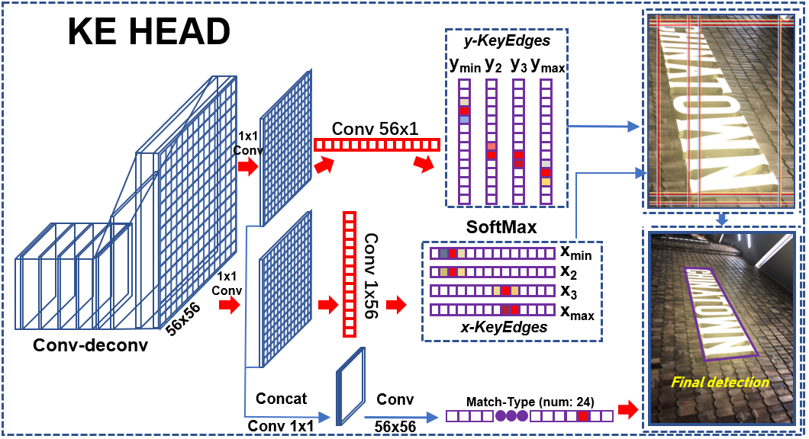

# Box_Discretization_Network
This repository is built on the **pytorch [[maskrcnn_benchmark]](https://github.com/facebookresearch/maskrcnn-benchmark)**. The method is the foundation of our ReCTs-competition method [[link]](https://rrc.cvc.uab.es/?ch=12), which won the **championship**.

PPT link [[Google Drive]](https://drive.google.com/file/d/1xgVx04RNbCbe6f1vCi-ccSqt0Ig07VaK/view?usp=sharing)[[Baidu Cloud]](https://pan.baidu.com/s/1g_uzMaag1w2LOm1Q_Cgk0g)

Generate your own **JSON**: [[Google Drive]](https://drive.google.com/file/d/1Rfv1pxDpoFGSqvzxJZCmGfpKhUe8P3Bk/view?usp=sharing)[[Baidu Cloud]](https://pan.baidu.com/s/1eEcczeNP9z5HzmxylkxCmw)

Brief introduction (in Chinese): [[Google Drive]](https://drive.google.com/file/d/1ED4TCXUFqV0fzBX4Cj29B6ndy1dqm1y-/view?usp=sharing)[[Baidu Cloud]](https://pan.baidu.com/s/1i0qngj3L3_Ezygp5KEXDCA&shfl=sharepset)

# Competition related
Competition model and config files (it needs a lot of video memory):
* Paper [[Link]](https://arxiv.org/pdf/1912.09629.pdf) (Exploring the Capacity of Sequential-free Box Discretization Networkfor Omnidirectional Scene Text Detection)
* Config file [[BaiduYun Link]](https://pan.baidu.com/s/1yKiyFGIQlooc_jGkMECREA). Models below all use this config file except directory. Results below are the multi-scale ensemble results. The very details are described in our updated paper.

* MLT 2017 Model [[BaiduYun Link]](https://pan.baidu.com/s/10p6ka_fYdACAdnlOHZcUSw). 

| MLT 2017 | Recall  | Precision  | Hmean  |
|:--------:  | :-----:   | :----:      |  :-----:     | 
| new | 76.44 | 82.75 | 79.47 |

* ReCTS 2019 model [[BaiduYun Link]](https://pan.baidu.com/s/1UaaOd-ByDaqbpVPFlQxw_w)

| ReCTS Detection | Recall  | Precision  | Hmean  |
|:--------:  | :-----:   | :----:      |  :-----:     | 
| new | 93.97 | 92.76 | 93.36 |

* HRSC_2016 model [[BaiduYun Link]](https://pan.baidu.com/s/16zEMmRAjrWKtQdDo00rLYw).

| HRSC_2016 | Recall  | Precision  | Hmean  | [TIoU-Hmean](https://github.com/Yuliang-Liu/TIoU-metric) | AP |
|:--------:  | :-----:   | :----:      |  :-----: | :-----: | :-----: | 
| IJCAI version | 94.8 | 46.0 | 61.96 | 51.1 | **93.7** |
| new | 94.1 | 83.8 | **88.65** | **73.3** | 89.22 |

* Online demo is updating (the old demo version used a wrong configuration). This demo uses the MLT model provided above. It can detect multi-lingual text but can only recognize English, Chinese, and most of the symbols. 

# Description
**Please see our paper at [[link]](https://arxiv.org/abs/1906.02371)**. <div align=center></div>

The advantages:
* BDN can directly produce compact quadrilateral detection box. (segmentation-based methods need additional steps to group pixels & such steps usually sensitive to outliers)
* BDN can avoid label confusion (non-segmentation-based methods are mostly sensitive to label sequence, which can significantly undermine the detection result). Comparison on ICDAR 2015 dataset showing different methods’ ability of resistant to the label confusion issue (by adding rotated pseudo samples). Textboxes++, East, and CTD are all Sesitive-to-Label-Sequence methods.

|    |  Textboxes++ [[code]](https://github.com/MhLiao/TextBoxes_plusplus)  |  East [[code]](https://github.com/argman/EAST)  |   CTD [[code]](https://github.com/Yuliang-Liu/Curve-Text-Detector)     |    Ours   | 
|:--------:  | :-----:   | :----:      |  :-----:     | :-----: |
| Variances (Hmean)| ↓ 9.7% | ↓ 13.7% | ↓ 24.6% | ↑ 0.3%|


# Getting Started

A basic example for training and testing. This mini example offers a pure baseline that takes **less than 4 hours** (with 4 1080 ti) to finalize training with only official training data. 

## Install anaconda 

Link：https://pan.baidu.com/s/1TGy6O3LBHGQFzC20yJo8tg psw：vggx

## Step-by-step install
 ```shell
conda create --name mb
conda activate mb
conda install ipython
pip install ninja yacs cython matplotlib tqdm scipy shapely
conda install pytorch=1.0 torchvision=0.2 cudatoolkit=9.0 -c pytorch
conda install -c menpo opencv
export INSTALL_DIR=$PWD
cd $INSTALL_DIR
git clone https://github.com/cocodataset/cocoapi.git
cd cocoapi/PythonAPI
python setup.py build_ext install
cd $INSTALL_DIR
git clone https://github.com/Yuliang-Liu/Box_Discretization_Network.git
cd Box_Discretization_Network
python setup.py build develop
```
* **MUST USE torchvision=0.2**

## Pretrained model：

[[Link]](https://drive.google.com/file/d/1pBQ53ZNvsdu8byFKDST-de30X5pEFI7C/view?usp=sharing)
unzip under project_root

（This is ONLY an ImageNet Model With a few iterations on ic15 training data for a stable initialization）

## ic15 data

Prepare data follow COCO format.
[[Link]](https://drive.google.com/file/d/16rpK9Ql4mZydl1CGPMQXf0Q8YQqtXnX7/view?usp=sharing)
unzip under datasets/

## Train

After downloading data and pretrained model, run
  ```shell
  bash quick_train_guide.sh
 ```

## Test with [[TIoU]](https://github.com/Yuliang-Liu/TIoU-metric)

Run 
 ```shell
 bash my_test.sh
```

Put kes.json to ic15_TIoU_metric/
inside ic15_TIoU_metric/

Run (conda deactivate; pip install Polygon2)
 ```shell
 python2 to_eval.py
```

Example results: 
* mask branch 79.4 (test segm.json by changing to_eval.py (line 10: mode=0) ); 
* kes branch 80.4; 
* in .yaml, set RESCORING=True -> 80.8;
* Set RESCORING=True and RESCORING_GAMA=0.8 -> 81.0;
* One can try many other tricks such as **CROP_PROB_TRAIN**, **ROTATE_PROB_TRAIN**, **USE_DEFORMABLE**, **DEFORMABLE_PSROIPOOLING**, **PNMS**, **MSR**, **PAN** in the project, whcih were all tested effective to improve the results. To achieve state-of-the-art performance, extra data (syntext, MLT, etc.) and proper training strategies are necessary. 

## Visualization 

Run 
 ```shell
 bash single_image_demo.sh
```

# Citation
If you find our method useful for your reserach, please cite
```
@article{liu2019omnidirectional,
  title={Omnidirectional Scene Text Detection with Sequential-free Box Discretization},
  author={Liu, Yuliang and Zhang, Sheng and Jin, Lianwen and Xie, Lele and Wu, Yaqiang and Wang, Zhepeng},
  journal={IJCAI},
  year={2019}
}
```

## Feedback 
Suggestions and discussions are greatly welcome. Please contact the authors by sending email to 
  `liu.yuliang@mail.scut.edu.cn` or `yuliang.liu@adelaide.edu.au`. For commercial usage, please contact Prof. Lianwen Jin via lianwen.jin@gmail.com.
